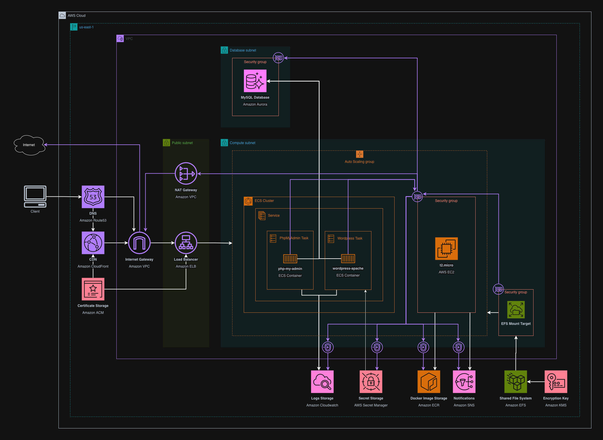

<p align="center">
  
</p>

> Deploys a highly available WordPress platform on AWS with Terraform, plus a local Docker workflow for manual testing.

[](https://github.com/pre-commit/pre-commit)


## Table of Contents

<!--TOC-->

- [Table of Contents](#table-of-contents)
- [⛔️ Warning](#-warning)
- [Introduction](#introduction)
- [Infrastructure diagram](#infrastructure-diagram)
- [⚠️ Important notes](#-important-notes)
- [Architecture overview](#architecture-overview)
- [Installation](#installation)
  - [Prerequisites](#prerequisites)
  - [1. Configure AWS access](#1-configure-aws-access)
  - [2. Review your Terraform variables](#2-review-your-terraform-variables)
  - [3. Initialize Terraform](#3-initialize-terraform)
  - [4. Plan the infrastructure](#4-plan-the-infrastructure)
  - [5. Apply the infrastructure](#5-apply-the-infrastructure)
  - [6. Destroy the infrastructure](#6-destroy-the-infrastructure)
- [Local Docker workflow](#local-docker-workflow)
  - [Prerequisites](#prerequisites-1)
  - [1. Create your local .env file](#1-create-your-local-env-file)
  - [2. Start the local stack](#2-start-the-local-stack)
  - [3. Stop or reset the local stack](#3-stop-or-reset-the-local-stack)
- [Load testing](#load-testing)
- [Terraform docs](#terraform-docs)

<!--TOC-->

## ⛔️ Warning

The sharing of this project on my GitHub aims to help peoples to open their minds to new logics or help peoples in case of difficulty. In no way, that aims to copy and paste this work on your own repository.

## Introduction

The aim of this project is to create and deploy a WordPress architecture in the cloud. The goal of deploying this kind of architecture in the cloud is to have a solution that can automatically scale in and out based on the current load, ensure high availability, take advantage of major cloud provider managed services, and avoid having to keep your Mac on all day to host your website.

In this project, you will find an architecture hosted on AWS and deployed using Terraform that aims to accomplish all the key points previously mentioned about the cloud.

## Infrastructure diagram



## ⚠️ Important notes

**AWS costs**: this infrastructure is not limited to free-tier resources. Running the full stack can incur charges.

**Hosted zone requirement**: the domain used in `domain_name` must already exist as a Route53 hosted zone in the same AWS account.

## Architecture overview

The currently deployed traffic paths are:

- `mamaurai.fr`
  - Route53 → CloudFront → ALB → WordPress ECS service
- `pma.mamaurai.fr`
  - Route53 → CloudFront → ALB → phpMyAdmin ECS service
- `performance.mamaurai.fr`
  - Route53 → direct HTTPS to ALB → WordPress ECS service

WordPress containers run on **ECS EC2 instances** in private subnets.

- The EC2 instances mount **EFS** on the host.
- WordPress uses the shared EFS content path from the host.
- WordPress connects to **Aurora MySQL** in the database subnets.

## Installation

### Prerequisites

Before deploying the AWS infrastructure, make sure you have:

| Requirement | Description |
|-------------|-------------|
| Terraform | Version `~> 1.13.4` |
| AWS CLI | Configured with credentials that can create the deployed resources |
| Docker | Required for local image builds during Terraform apply |
| jq | Used by Make and helper scripts |
| Route53 hosted zone | Must already exist for the chosen public domain |

### 1. Configure AWS access

Configure the AWS CLI with credentials that can manage the full infrastructure:

```sh
aws configure
```

### 2. Review your Terraform variables

The repository uses:

```text
terraform/main.auto.tfvars.json
```

Review it carefully before deployment.

### 3. Initialize Terraform

```sh
make terraform-init
```

### 4. Plan the infrastructure

```sh
make terraform-plan
```

### 5. Apply the infrastructure

```sh
make terraform-apply
```

### 6. Destroy the infrastructure

```sh
make terraform-destroy
```

## Local Docker workflow

### Prerequisites

The local stack uses Docker Compose and a local MySQL container.

### 1. Create your local .env file

Create a local `.env` file from the template:

```sh
cp .env.template .env
```

Then set at minimum:

```env
ENABLE_LOCAL_STACK=true
```

You can also provide AWS credentials in `.env` if you want the local WordPress bootstrap to fetch secrets and SSM parameters.

### 2. Start the local stack

```sh
make docker-up ENABLE_LOCAL_STACK=true
```

Local entrypoints:

- WordPress: `http://localhost:8080`
- phpMyAdmin: `http://localhost:8081`

### 3. Stop or reset the local stack

Stop the stack:

```sh
make docker-down ENABLE_LOCAL_STACK=true
```

Rebuild and restart it:

```sh
make docker-reset ENABLE_LOCAL_STACK=true
```

If you want logs in the foreground when starting the stack:

```sh
make docker-up ENABLE_LOCAL_STACK=true DETACH_CONTAINERS=false
```

## Load testing

The repository includes a `siege` target for quick load tests.

Default usage:

```sh
make siege
```

Example against the performance hostname:

```sh
make siege SIEGE_CONCURRENCY=80 SIEGE_DURATION=10M SIEGE_DELAY=0
```

Useful variables:

- `SIEGE_URL`
- `SIEGE_CONCURRENCY`
- `SIEGE_DURATION`
- `SIEGE_DELAY`
- `SIEGE_FILE`

## Terraform docs

_This section is intended for generated Terraform documentation._

<!-- BEGIN_TF_DOCS -->
<!-- END_TF_DOCS -->
