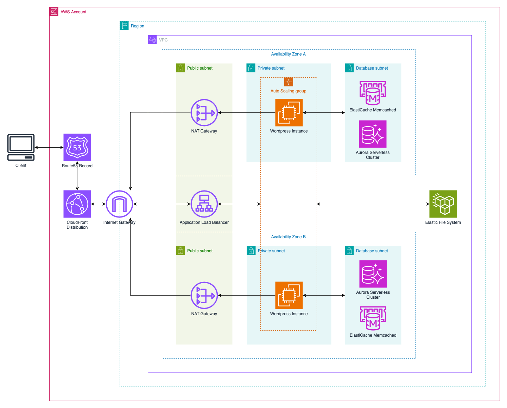

<p align="center">
  
</p>

---

> Complete WordPress architecture deployed on AWS.

## 🗂️ Table of Contents

* [⛔️ Warning](#-warning)
* [❓ What is it](#-what-is-it)
* [📊 Prerequisites](#-prerequisites)
* [🔧 Installation](#-installation)
* [🚀 Terraform Deployment](#-terraform-deployment)
* [🏫 42 Correction Deployment](#-42-correction-deployment)

## ⛔️ Warning

This architecture, once deployed, may incur costs as not all resources are covered under the AWS free tier. If you set the `domain_name` variable, ensure you have a hosted zone for this domain name in the same AWS account used to deploy the infrastructure.

## ❓ What is it

This project is designed to deploy a fully functional WordPress website using AWS as the cloud provider. The architecture ensures high availability, resilience to availability zone (AZ) failures, and scalability. The deployment is managed through Terraform and includes the following components:



### Architecture Breakdown

- **Route 53**: Amazon's DNS service for creating DNS records for your domain.
- **CloudFront**: Provides access to AWS edge locations for faster content delivery and caching of WordPress assets.
- **Application Load Balancer**: Distributes incoming traffic across multiple EC2 instances.
- **Memcached**: Speeds up database queries by caching frequently accessed data.
- **Aurora Serverless Cluster**: A highly available, multi-AZ, fully managed MySQL database service.
- **Auto Scaling Group**: Automatically adjusts the number of EC2 instances based on CPU utilization.
- **Elastic File System (EFS)**: A shared file system for WordPress instances to access common resources.

## 📊 Prerequisites

Ensure the following tools are installed before deploying the architecture:

- [Terraform](https://www.terraform.io)
- [AWS CLI](https://github.com/aws/aws-cli)

## 🔧 Installation

### AWS CLI Configuration

Set up AWS CLI with your credentials:

```sh
aws configure
```

## 🚀 Terraform Deployment

### Initialization

Navigate to the `terraform/` directory and initialize the Terraform environment:

```sh
terraform init
```

### Terraform Variables

Customize the architecture by modifying these variables:

| Variable Name              | Default Value                  | Type           | Description                                                                                                                           |
|----------------------------|--------------------------------|----------------|---------------------------------------------------------------------------------------------------------------------------------------|
| `name`                     | `"wordpress"`                 | `string`       | The prefix for all resource names. Must be at least 7 characters long.                                                                |
| `region`                   | `"eu-west-3"`                 | `string`       | The AWS region where most resources will be deployed.                                                                                 |
| `azs`                      | `["eu-west-3a", "eu-west-3b", "eu-west-3c"]` | `list(string)` | Availability zones for WordPress deployment. Specify at least two.                                                                   |
| `domain_name`              | `null`                         | `string`       | The domain name for creating a new DNS record pointing to the CloudFront distribution.                                                |
| `distribution_price_class` | `null`                         | `string`       | CloudFront price class (e.g., PriceClass_All, PriceClass_200, PriceClass_100).                                                        |
| `asg_min`                  | `1`                            | `number`       | Minimum size of the auto-scaling group.                                                                                               |
| `asg_max`                  | `3`                            | `number`       | Maximum size of the auto-scaling group.                                                                                               |
| `instance_type`            | `"t2.micro"`                  | `string`       | Instance type for the auto-scaling group.                                                                                            |
| `wp_version`               | `"latest"`                    | `string`       | WordPress version to install.                                                                                                         |
| `wp_site_title`            | `"website"`                   | `string`       | Title of the WordPress site.                                                                                                          |
| `wp_admin_username`        | `"admin"`                     | `string`       | WordPress administrator username.                                                                                                     |
| `wp_admin_email`           | *(required)*                   | `string`       | Administrator email for WordPress and SNS notifications.                                                                              |
| `wp_admin_password`        | *(required)*                   | `string`       | Password for the WordPress administrator account.                                                                                     |
| `wp_language`              | `"en_US"`                     | `string`       | WordPress language.                                                                                                                   |
| `mysql_version`            | `"8.0"`                       | `string`       | MySQL version for Aurora.                                                                                                             |
| `aurora_master_username`   | `"master"`                    | `string`       | Master username for the Aurora database.                                                                                              |
| `aurora_min_capacity`      | `0.5`                          | `number`       | Minimum capacity for the Aurora cluster.                                                                                              |
| `aurora_max_capacity`      | `1`                            | `number`       | Maximum capacity for the Aurora cluster.                                                                                              |
| `database_name`            | `"wordpress"`                 | `string`       | MySQL database name.                                                                                                                  |
| `aurora_instances`         | `{ one = {} }`                 | `map(any)`     | Instances for the Aurora Serverless cluster.                                                                                          |
| `aurora_skip_final_snapshot`| `false`                       | `bool`         | Skip final snapshot before cluster deletion.                                                                                          |
| `backup_region`            | `null`                         | `string`       | Region for EFS replica creation (if specified).                                                                                       |

### Applying the Configuration

Deploy the infrastructure using:

```sh
terraform apply
```

### Outputs

After deployment, the following outputs will be displayed:

| Output Name            | Description                                                                 |
|------------------------|-----------------------------------------------------------------------------|
| `database_secret_arn`  | ARN of the secret containing the master password for the Aurora database.    |
| `cloudfront_dns_name`  | DNS name of the CloudFront distribution (if `domain_name` is `null`).       |

### Destroying the Infrastructure

To delete all resources:

```sh
terraform destroy
```

## 🏫 42 Correction Deployment

To meet 42's requirements, you can deploy the architecture using a `docker-compose` file with Terraform's official Docker image.

### Initialization

1. Create a `.env` file based on `.env.template` and update it with your credentials.
2. Initialize the Terraform environment using Docker Compose:

```sh
docker-compose run --rm terraform init
```

### Applying the Configuration

Deploy the infrastructure with Docker Compose:

```sh
docker-compose run --rm terraform apply -auto-approve
```

### Destroying the Infrastructure

Delete all resources using Docker Compose:

```sh
docker-compose run --rm terraform destroy -auto-approve
```

## 👥 Authors

- [@mathias-mrsn](https://github.com/mathias-mrsn)
- [@xchalle](https://github.com/xchalle)

